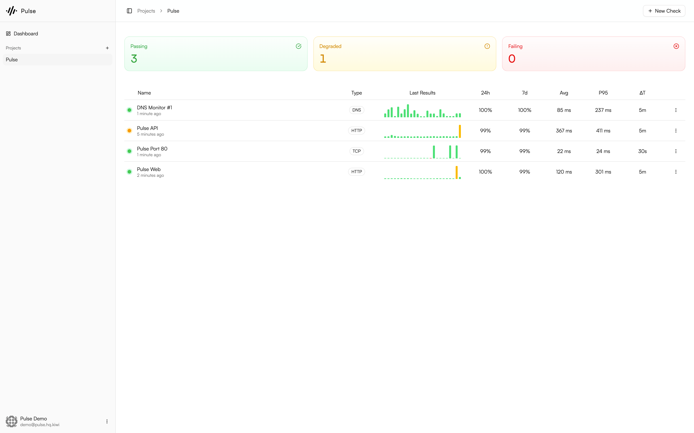

<div align="center">
  <picture width="140">
     <source media="(prefers-color-scheme: dark)" srcset="./public/icon-dark-512.png">
    <source media="(prefers-color-scheme: light)" srcset="./public/icon-light-512.png">
    
  </picture>
  <h2 align="center">Pulse</h2>
  <p align="center">🔥 Self-hosted synthetic monitoring made simple.</p>
</div>

<div align="center">

[](https://github.com/mukundshah/pulse/stargazers)
[](https://github.com/mukundshah/pulse/network/members)
[](https://github.com/mukundshah/pulse/issues)
[](https://github.com/mukundshah/pulse/blob/master/LICENSE)
[](https://twitter.com/intent/tweet?text=Self-hosted%20synthetic%20monitoring%20made%20simple.%0D%0A&url=https%3A%2F%2Fgithub.com%2Fmukundshah%2Fpulse)

</div>

> [!NOTE]
> This is an experimental learning project. Inspired by [Checkly](https://www.checklyhq.com/), it was built to understand how synthetic monitoring systems work. Active maintenance isn't guaranteed, though I may continue development if there's interest.

## 🚀 Installation

### Prerequisites

- **Taskfile**
- **Go 1.25+**
- **PostgreSQL 18+**
- **Redis 8+**
- **ClickHouse**

_Alternatively, you can spin up the infrastructure services using Docker Compose._

```bash
# Start infrastructure services, if not already running
task docker:infra:up

# Copy environment template and edit it to your needs
cp .env.example .env

# Run database migrations
task db:migrate

# Start api, worker and web
task dev:all
```

## About This Project

Pulse started as an experimental project to learn how synthetic monitoring systems work. Inspired by [Checkly](https://www.checklyhq.com/), it's a self-hosted implementation built from the ground up to understand the architecture, challenges, and design decisions that go into building a monitoring platform.

This is primarily a learning project, and active maintenance isn't guaranteed. That said, if there's interest and usage, I may continue developing it.

**Contributions, feedback, and discussions are still welcome!**

## Screenshots

<picture>
  <source media="(prefers-color-scheme: dark)" srcset="./public/screenshots/screenshot-1-dark.png">
  <source media="(prefers-color-scheme: light)" srcset="./public/screenshots/screenshot-1-light.png">
  
</picture>

## 📄 License

This project is licensed under the **GNU Affero General Public License v3.0 (AGPL-3.0)**. See the [LICENSE](LICENSE) file for details.
